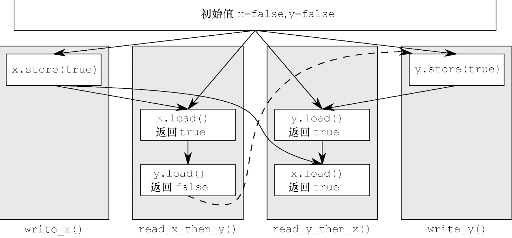
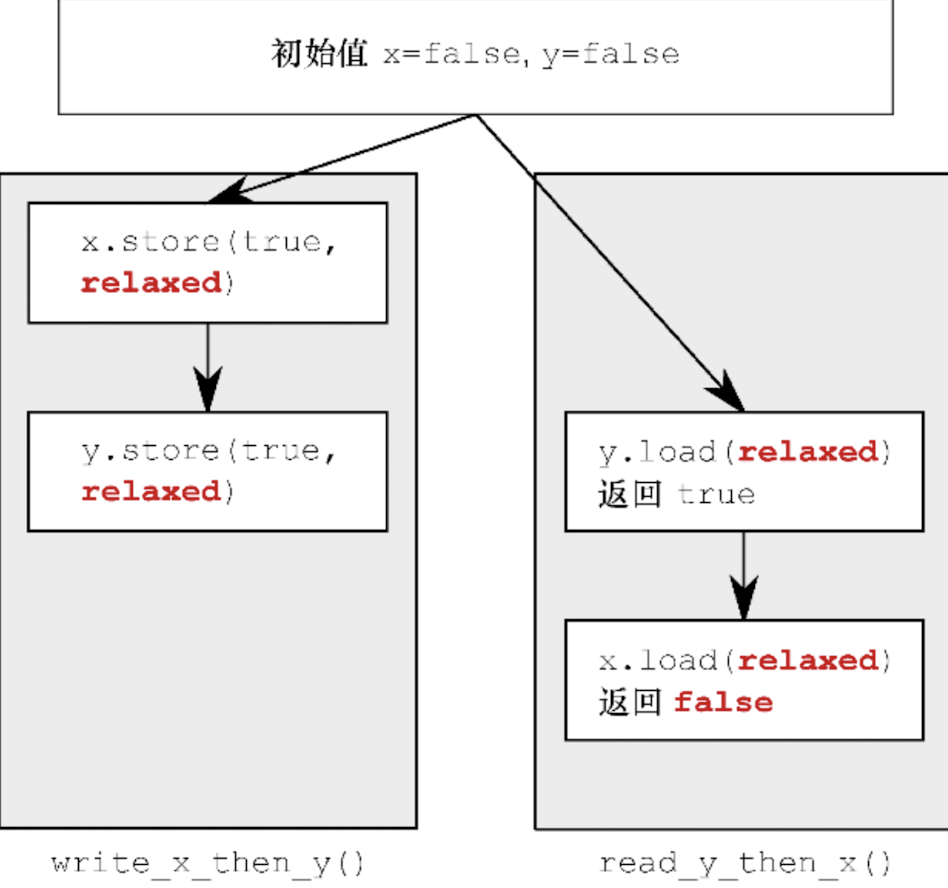
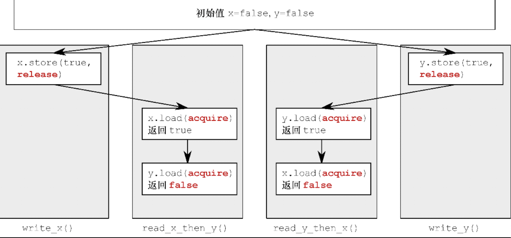

# C++并发编程实战

## 5 C++内存模型和原子操作

C++标准只将“对象”定义为“某一存储范围”（a region of storage）。
不论对象属于什么类型，它都会存储在一个或多个内存区域中。

### 5.2 原子操作

#### 5.2.1 `std::atomic_flag`

#### 5.2.2 `std::atomic<bool>`

+ 不能拷贝复制和拷贝赋值，因为过程中涉及两个原子对象的操作，过程中不能保证原子性。
+ 赋值操作符按值返回，而不是按引用返回。

CAS: Compare And Swap  

+ `compare_exchange_strong` : 参数包括一个预期值、一个赋值的值。  
    1）如果原子变量本身和预期值相等，那么原子变量会被赋值，函数返回true；  
    2）否则原子变量不发生赋值，且预期值会被修改为原子变量的值，函数返回false;  
+ `compare_exchange_weak` : 和上面函数功能一致，只是在某些架构下有可能发生佯败  
    1）有些平台上strong就是用weak+循环实现的，所以strong的性能可能比weak差  
    2）在本身就需要循环使用CAS的场景，一般采用weak性能会更好
+ 它们接收两个内存次序参数。这使程序能区分成功和失败两种情况，采用不同的内存次序语义，因为失败的情况下没有store语意
+ 佯败 : 原子化的比较-交换必须由一条指令单独完成，而某些处理器没有这种指令，无从保证该操作按原子化方式完成。非原子化的操作执行过程中，线程就有可能执行到中途因系统调度而切出，导致操作失败。
+ 因为compare_exchange_weak()可能佯败，所以它往往必须配合循环使用。

```C++
bool expected = false;
extern atomic<bool> b;
while (!b.compare_exchange_weak(expected, true) && !expected);
```

只要expected变量还是false，就说明compare_exchange_weak()的调用发生佯败，我们就继续循环。  
继续循环有两个条件：
1）exchange返回false
2) expect为false
如果exchange是因为原子变量和expect不相等导致的返回false，那么expect会被更新为true;
而这里expect为false，所以exchange返回false只有一种可能，那就是发生了佯败

#### 5.2.3 `std::atomic<T*>`

+ 读-改-写 ：读出变量的值，并赋予变量新值
+ `fetch_add` `fetch_sub`，加、减操作，返回变量未修改前的值，可以指定内存序
+ 操作符+ -，返回变量修改之后的值，不能指定内存序，默认用最强的内存序

+ 先后一致性次序
+ 非先后一致性次序
+ 宽松次序
+ 先行关系 : happens-before，在...之前发生
+ 同步关系 : synchronizes-with  
            有两个线程对原子变量x分别进行读和写，如果线程1写的值被线程2读到了，那么线程1和2在这个点完成同步：
            线程1写之前到操作，必须先于线程2读之后的操作。

#### 内存序

先后一致性次序  

+ memory_order_seq_cst: 若某项操作标记为memory_order_seq_cst，则编译器和CPU须严格遵循源码逻辑流程的先后顺序。  
  在相同的线程上，以该项操作为界，其后方的任何操作不得重新编排到它前面，而前方的任何操作不得重新编排到它后面，  
  其中“任何”是指带有任何内存标记的任何变量之上的任何操作。  
  按照**memory_order_seq_cst**次序，所有以它为标记的操作会形成**单一的全局总操作序列**。
  

**非先后一致性次序**  
事件不再服从单一的全局次序。换言之，不同线程所看到的同一组操作的次序和效果可能呈现差异。  
因为不同cpu之间的cache可能不同步。

**宽松次序**  
该内存次序的唯一要求是，在一个线程内，对相同变量的访问次序不得重新编排。  
对于给定的线程，一旦它见到某原子变量在某时刻持有的值，则该线程的后续读操作不可能读取相对更早的值。


+ memory_order_relaxed: memory_order_relaxed次序无须任何额外的同步操作，线程间仅存的共有信息是每个变量的改动序列。

**获取释放次序**


+ memory_order_acquire : 读取操作
+ memory_order_release : 写入操作
+ memory_order_acq_rel : 读改写操作

获取释放次序：获取-释放次序比宽松次序严格一些，它会产生一定程度的同步效果，而不会形成服从先后一致次序的全局总操作序列。  
获取-释放次序可用于多线程之间的数据同步，即使“过渡线程”的操作不涉及目标数据，也照样可行。

总结一下

### 5.Q

+ 为什么要test_and_set这种操作
