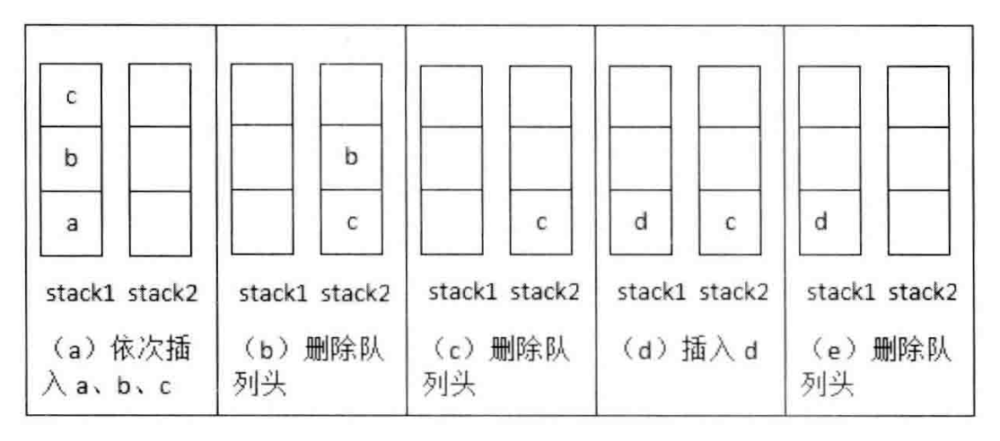
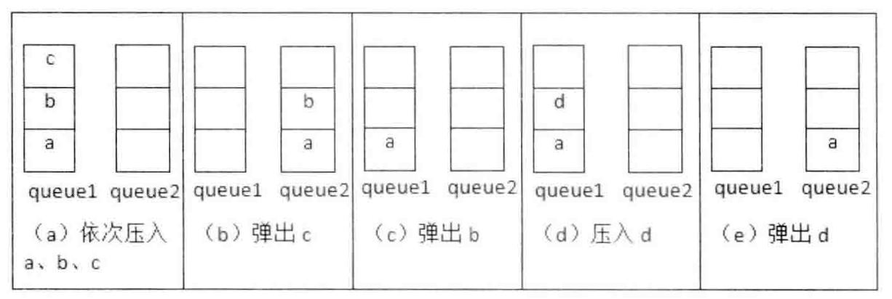

# 剑指offer

## 第一章 面试流程

+ 介绍项目经验：  

> 1）简单的项目背景  
  2）自己完成的任务  
  3）为了完成任务，是怎么做的  
  4）自己的贡献  

+ 为什么跳槽？  

> 希望寻找一份更有挑战的工作，面试的职位为什么有兴趣

+ 技术面试

> 1）扎实的基础  ：语言、数据结构、算法  
  2）高质量的代码：考虑边界条件、错误处理
  3）清晰的思路：
  >> a. 举几个简单的例子，尝试找规律  
     b. 试着用图形表示抽象的数据结构  
     c. 试着把复杂的问题，分解成简单的子问题  
>
> 4）优化效率的能力  
  5）优秀的综合能力  
  >> a. 通过询问你看什么书，从中学到什么新技术，判断学习能力  
     b. 抛出一个新的概念，看理解能力  
     c. 知识迁移的能力，先提出一个简单问题，然后提出一个复杂问题，看能不能通过简单问题找到解决复杂问题的思路  
     d. 抽象建模、思维发散能力  

+ 应聘者的提问环节  

> 1）与应聘职位和项目相关的问题  

## 第二章 面试需要的基础知识  

### C++

+ [Q1 添加赋值运算符](./Question/Q01_AssignmentOperator.cpp)

a. 需要判断是不是对自身赋值  
b. 需要返回*this，这样才能连续赋值  
c. 需要注意释放原本对象中的资源  
d. 为了防止new时发生异常，导致状态异常or资源泄露，使用copy and swap  

非异常安全版本：  

```C++
CMyString& CMyString::operator= (const CMyString& str)
{
    if (this == &str) return *this;

    delete[] m_pData;
    int len = strlen(str.m_pData);
    m_pData = new char[len + 1];

    strcpy(m_pData, str.m_pData);
    return *this;
}
```

异常安全版本：  

```C++
CMyString& CMyString::operator= (const CMyString& str)
{
    if (this != &str)
    {
        CMyString newStr = str;
        char* tempStr  = newStr.m_pData;
        newStr.m_pData = this->m_pData;
        this->m_pData  = tempStr;
    }
    return *this;
}
```

+ [Q2 实现Singleton模式](./Question/Q02_Singleton.cpp)  

a. 构造函数设置为私有  
b. 禁止拷贝构造、拷贝赋值  
c. C++保证static变量初始化过程是线程安全的  

```C++
class Singleton
{
public:
    static Singleton& getInstance()
    {
        static Singleton instance;
        return instance;
    }
private:
    Singleton(){}
    Singleton(const Singleton& sin) = delete;
    Singleton& operator= (const Singleton& sin) = delete;
};
```

### 数据结构

#### 数组  

a. 当数组作为函数的参数进行传递时，数组就自动退化为同类型的指针  

+ [Q3 数组中重复的数字](./Question/Q03_DuplicationInArray.cpp)  

> 找出数组中重复的数字  
  在一个长度为n的数组中，所有数字大小都在0～n-1的范围内，  
  数组中有些数字是重复的，请找出数组中任意重复的数字。  

a. 可以使用哈希表或者排序，但是无法同时满足时间复杂度O(N)，空间复杂度O(1)  
b. 通过题目描述，如果数组中没有重复的数字，那么排序好的数组中每个位置的值应该和下标相等`idx == nums[idx]`  
c. 所以我们将数组中每个数字放到它对应的地方，如果发现对应位置已经是正确的数，那么说明该数字重复  

```C++
    for (int i = 0; i < len; i++)
    {
        // 将nums[i]放到它对应的位置上
        while (nums[i] != i)
        {
            // 如果对应位置上已经是正确的数，那么说明重复了
            if (nums[i] == nums[nums[i]])
            {
                res = nums[i];
                return true;
            }
            else
            {
                std::swap(nums[i], nums[nums[i]]);
            }
        }
    }
```

+ [Q3-2 不修改数组，找出重复数字](./Question/Q03_02_DuplicationInArrayNoEdit.cpp)

> 在一个长度为n + 1的数组里，所有数字都在1～n的范围，所以数组中至少有一个数字是重复的  
  请找出数组中的任意一个重复数字，但不能修改数组  

  a. 最简单的办法是使用集合，或者一个辅助数组，遍历一遍数组然后记录在集合中，判断是否有重复  
  b. 还有一种不需要额外空间的做法，由题意可知，初始区间是[1, n]，我们可以利用二分法逐渐缩小这个区间  
  c. 平分初始区间[1, mid] [mid + 1, n]，统计数组中的数，落在两个区间的数量，如果数量大于区间长度，则说明区间中有重复数字。选择有重复数字的子数组，重复这个过程，直到区间长度为1，这就是我们想找的重复数字。

+ [Q4 二维数组中的查找](./Question/Q04_FindInPartialSortedMatrix.cpp)

> 在一个二维数组中，每一行都按照从左到右递增的顺序，每一列也按照从上到下递增的顺序
  给你一个二维数组和整数，请查找整数是否包含在二维数组中  

  a. 如果起始点选择左上角，假如target比左上角大，那么target有可能在右边，也有可能在下边，我们无法排出某一行列。选择右下角同理。  
  b. 如果起始点选择右上角，假如target比右上角大，那么target只能出现在下方，假如target比右上角小，那么target只能出现在左边。每次比较可以排出一行或者一列，选择左下角同理。  
  c. 所以这个问题的关键在于起始点的选择，通常我们可以通过实际画图模拟想到思路。  

#### 字符串

+ C++每个字符串都会用`\0`结尾，所以字符串占用的内存会比实际内容多一个字节  
+ 为了节省内存，C++把常量字符串放在单独一个内存区域，当一个常量字符串同时赋值给几个指针时，指针会指向相同的内存地址  

```C++
char* str1 = "Hello world";
char* str2 = "Hello world";
assert(str1 == str2);
```

+ [Q5 替换空格](./Question/Q05_ReplaceSpace.cpp)  

> 请实现一个函数，将字符串中的空格都替换成20%，在原字符串上操作  

  a. 如果我们从字符串起始点开始操作，那么每遇到一个空格，就需要移动一次字符串，如果有n个空格，那么复杂度是O(n^2)  
  b. 所以我们可以先统计空格的数量，计算替换完成后字符串的长度，然后将字符串依次往末尾移动，遇到空格时替换为"20%"即可，从后往前复制只需要移动一次字符串。  
  c. 在合并两个数组or字符串时，如果从前往后复制需要移动数组多次，那么我们可以考虑从后往前复制，这样能减少移动次数

#### 链表

```C++
struct ListNode
{
    int value;
    ListNode* pNext;
};
```

1. 在操作链表中的元素时，总是要特殊考虑链表头，例如删除链表头，插入链表头
2. 所以链表头是有可能被改变的，因此函数参数传递链表头指针时，要使用指针的指针`ListNode** pHead`

+ [Q6 从尾到头打印链表](./Question/Q05_Tail2HeadPrint.cpp)

a. 单向链表只能从头到尾遍历，想要从尾到头打印可以利用栈后进先出的特点  
b. 也可以使用递归，递归本身也是一种栈

#### 树

1. 前序遍历：根左右
2. 中序遍历：左根右
3. 后序遍历：左右根
4. 层序遍历：宽度优先遍历
5. 二叉搜索树：左节点小于等于根节点，右节点大于等于根节点，因此可以在logn的时间内找到一个节点
6. 堆：分最大堆和最小堆，最大堆根节点值最大，最小堆根节点值最小
7. 红黑树：节点定义为红黑两种颜色，stl中的map、set等都是利用红黑树实现

```C++
struct BinaryTreeNode
{
    int value;
    BinaryTreeNode* pLeft;
    BinaryTreeNode* pRight;
}
```

+ [Q7 重建二叉树](./Question/Q07_ConstructTree.cpp)

> 输入某二叉树等前序遍历和中序遍历，请重建该二叉树
  假设树中没有重复的数字

+ 利用前序遍历寻找根节点，利用根节点和中序遍历，将数组拆分为左右子树递归处理

+ [Q8 二叉树的下一个节点](./Question/Q08_NextNodeInBinaryTree.cpp)

> 给定一个二叉树和其中一个节点，找出该节点在中序遍历中的下一个节点
  树中的节点除了有左右节点的指针，还有一个指向父节点的指针

a. 如果节点有右子树，那么下一个节点就是有子树中最左的叶子节点  
b. 如果节点没有右子树，且节点是其父节点的左子节点，那么下一个节点就是其父节点  
c. 如果节点没有右子树，且节点是其父节点的右子节点，那么说明其父节点已经遍历完成了，继续向上寻找符合b条件的节点。  

#### 栈和队列

1. 栈，后进先出，DFS
2. 队列，先进先出，BFS

+ [Q09 用两个栈实现队列](./Question/Q09_Stack2Queue.cpp)



+ 两个队列实现栈  


### 算法和数据操作
